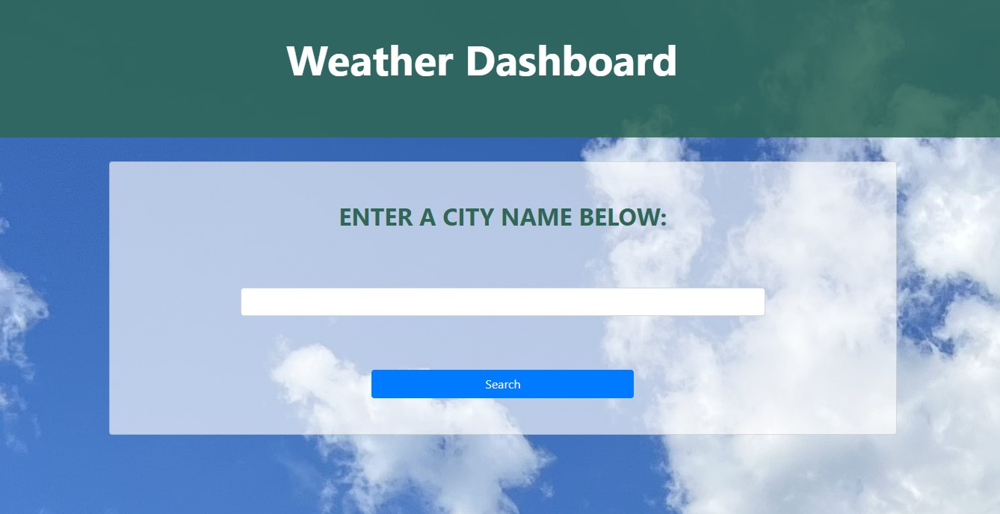
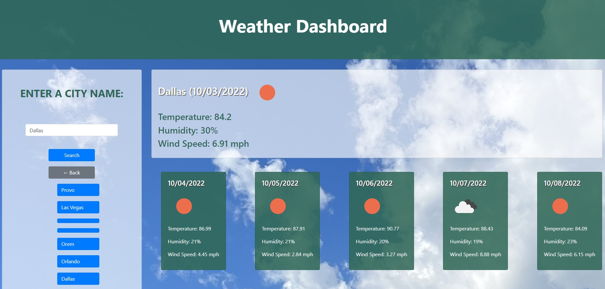

# Small Talk Weather
 
## Description

This project is a weather forecast web page. It will bring up results for current and future weather conditions for any city that the user searches. It also stores previous searches locally. I made this project in order to get more experience working with API's and local storage. It is a very useful page because everyone wonders what the weather will be and how it will affect their lives. This project was made using the Open Weather API's for current weather data and 5 day/3 hour forecasted weather data. I also use HTML, CSS, JS, and local storage.
 
 
## Usage
 
Open the web page in your browser. Search for a city. You can also click on your previous searches to search them again.
 
 
## Link to Project
 
[Small_Talk_Weather](https://autumnlegere.github.io/smalltalkweather)
 
 
## Screenshot
 
This is a screenshot of the project home page.

This is a screenshot of the results page.

 
 
## Credits
 
- Code for using a for loop to iterate at increments greater than 1. Used to iterate through forecast weather results  
    - [delftstack.com](https://www.delftstack.com/howto/javascript/javascript-increment-by-2/)
